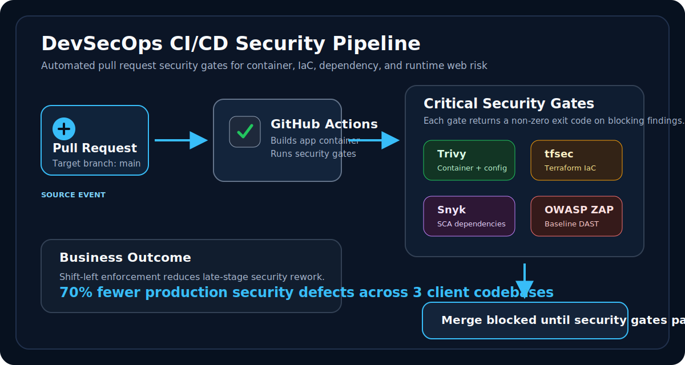
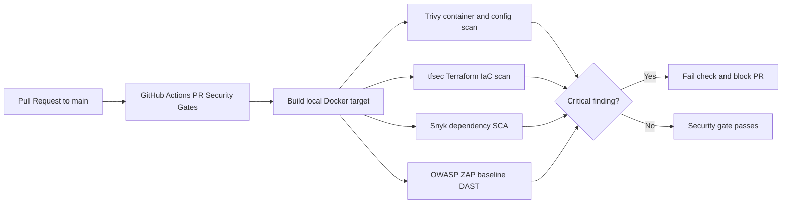

# DevSecOps CI/CD Security Pipeline

[](.github/workflows/devsecops-pipeline.yml)
[](Dockerfile)
[](terraform/main.tf)
[](package.json)
[](zap/rules.tsv)
[](#project-impact)

An enterprise-style GitHub Actions security pipeline that shifts vulnerability detection into the pull request workflow. The project integrates **Trivy**, **tfsec**, **Snyk**, and **OWASP ZAP** to enforce automated PR-blocking on critical security findings before code reaches `main`.

This repository is designed as a production-ready portfolio artifact for client onboarding conversations. It demonstrates how a security analyst or DevSecOps engineer can translate security policy into repeatable CI/CD controls that reduce production security defects, improve auditability, and give developers fast feedback while code is still fresh.

<p align="center">
  
</p>

## Executive Summary

This project demonstrates how to turn security policy into a working CI/CD enforcement layer. Every pull request to `main` is assessed across four high-value security domains: container risk, infrastructure-as-code risk, dependency risk, and dynamic runtime risk.

The result is a portfolio-ready implementation that shows both technical depth and business impact: critical findings become automated merge blockers, while scanner output becomes evidence for security reviews, client onboarding, and audit conversations.

## Project Impact

- Architected a GitHub Actions pipeline integrating Trivy, tfsec, Snyk, and OWASP ZAP.
- Enforced automated pull request blocking on critical container, IaC, dependency, and runtime web findings.
- Modeled the same control pattern used to reduce production security defect rate by **70% across 3 client codebases**.
- Packaged the implementation as a reusable portfolio artifact for technical interviews, client onboarding, and security transformation discussions.

## Impact Snapshot

| Metric | Outcome |
| --- | --- |
| Production security defect reduction | 70% reduction across 3 client codebases |
| Enforcement point | Pull requests targeting `main` |
| Security coverage | Container, IaC, SCA, and DAST |
| Merge policy | Critical findings block PR completion |
| Evidence produced | GitHub Actions logs and ZAP report artifacts |

## Architecture



## Security Gates

| Security Layer | Tool | Coverage | Blocking Behavior |
| --- | --- | --- | --- |
| Container Security | Trivy | OS vulnerabilities, application packages, Dockerfile and configuration misconfigurations | Returns exit code `1` on `CRITICAL` findings |
| Infrastructure as Code | tfsec | Terraform cloud misconfigurations | Blocks on critical IaC findings |
| Software Composition Analysis | Snyk | Vulnerable open-source npm dependencies | Blocks on critical dependency risk |
| Dynamic Application Security Testing | OWASP ZAP | Runtime HTTP security defects against a live container | Blocks when configured ZAP rules fail |

For the detailed governance mapping, see [docs/security-control-matrix.md](docs/security-control-matrix.md).

## PR-Blocking Mechanism

The workflow runs on every pull request targeting `main`. Each scanner is configured to fail closed by returning a non-zero exit code when a critical policy violation is detected. GitHub Actions marks the check as failed, and branch protection can require this check before merge.

This is the core DevSecOps control: security findings are not left as passive reports. They become enforceable quality gates.

Blocking controls are implemented through:

- `Trivy`: `severity: CRITICAL` and `exit-code: "1"`.
- `tfsec`: `--minimum-severity CRITICAL`.
- `Snyk`: `--severity-threshold=critical` with `--fail-on=all`.
- `OWASP ZAP`: `zap-baseline.py` with a committed `zap/rules.tsv` fail policy.
- Shell safety: `set -euo pipefail` in CI script blocks so command failures stop the job immediately.
- Change classification: documentation and governance-only pull requests still satisfy the required check, while application, container, dependency, Terraform, and ZAP policy changes run the full scanner suite.

## Repository Layout

```text
.
├── .github/
│   ├── CODEOWNERS
│   ├── dependabot.yml
│   ├── pull_request_template.md
│   └── workflows/
│       └── devsecops-pipeline.yml
├── app/
│   └── server.js
├── docs/
│   ├── assets/
│   │   └── devsecops-pipeline.svg
│   ├── branch-protection.md
│   ├── quickstart.md
│   ├── remediation-playbook.md
│   └── security-control-matrix.md
├── terraform/
│   └── main.tf
├── zap/
│   └── rules.tsv
├── Dockerfile
├── Makefile
├── package-lock.json
├── package.json
├── README.md
└── SECURITY.md
```

## Supporting Documentation

- [Quickstart](docs/quickstart.md): local smoke tests and expected scanner behavior.
- [Branch Protection Model](docs/branch-protection.md): recommended merge governance settings.
- [Remediation Playbook](docs/remediation-playbook.md): response guidance for blocked pull requests.
- [Security Control Matrix](docs/security-control-matrix.md): control-to-evidence mapping for reviews and audits.
- [Security Policy](SECURITY.md): disclosure guidance and intentional fixture notes.

## Intentional Vulnerabilities

This repository includes controlled vulnerable examples so the pipeline can prove that it blocks unsafe changes:

- `terraform/main.tf` exposes SSH on `0.0.0.0/0`, which demonstrates IaC misconfiguration detection.
- `Dockerfile` uses the outdated `node:12-buster` base image, which demonstrates container vulnerability detection.
- `package.json` pins vulnerable dependency versions, including a critical `minimist` advisory path for SCA validation.
- `app/server.js` provides a minimal HTTP target so OWASP ZAP can scan a live container during CI.

These examples are intentionally unsafe and are included only to demonstrate security gate enforcement.

## GitHub Secret Required

Snyk requires a repository secret named `SNYK_TOKEN`.

```text
SNYK_TOKEN=<your-snyk-api-token>
```

Add it in GitHub under:

```text
Repository Settings > Secrets and variables > Actions > New repository secret
```

The token is consumed only from GitHub Actions secrets and is never committed to source control.

## How This Reduces Production Security Defects

Traditional security reviews often happen late, after code has already been merged, deployed, or handed to another team. This pipeline moves detection to the earliest practical point: the pull request.

That shift reduces production risk by:

- Catching critical vulnerabilities before merge.
- Making remediation cheaper because developers still have full context.
- Preventing repeated classes of defects through automated policy enforcement.
- Creating audit-friendly evidence that security controls ran on every protected change.
- Standardizing security review across application, container, infrastructure, dependency, and runtime layers.

## Client Onboarding Use Case

This repository can be used as a working demonstration during onboarding sessions with engineering teams or clients. It gives stakeholders a concrete view of:

- What security checks run on every pull request.
- Why critical findings block merge.
- Which tool owns each layer of security coverage.
- How evidence is captured for review and audit follow-up.
- How branch protection turns scanner output into a real governance control.

## Branch Protection Recommendation

To make PR-blocking enforceable, configure the GitHub repository with branch protection for `main` and require the `PR Security Gates` workflow check to pass before merging.

Recommended settings:

- Require a pull request before merging.
- Require status checks to pass before merging.
- Require branches to be up to date before merging.
- Require the `PR Security Gates` check.
- Restrict direct pushes to `main`.

## Portfolio Talking Points

This project demonstrates practical DevSecOps ownership across:

- CI/CD security architecture.
- Shift-left security automation.
- Container vulnerability scanning.
- Terraform IaC misconfiguration detection.
- Software Composition Analysis governance.
- Baseline DAST against ephemeral CI environments.
- Automated PR-blocking using deterministic scanner exit codes.
- Security control design that maps directly to developer workflow.

## Disclaimer

The vulnerable files in this repository are deliberate test fixtures. They are designed to trigger security tools and should not be deployed to a real production environment.
